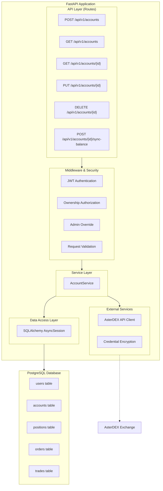
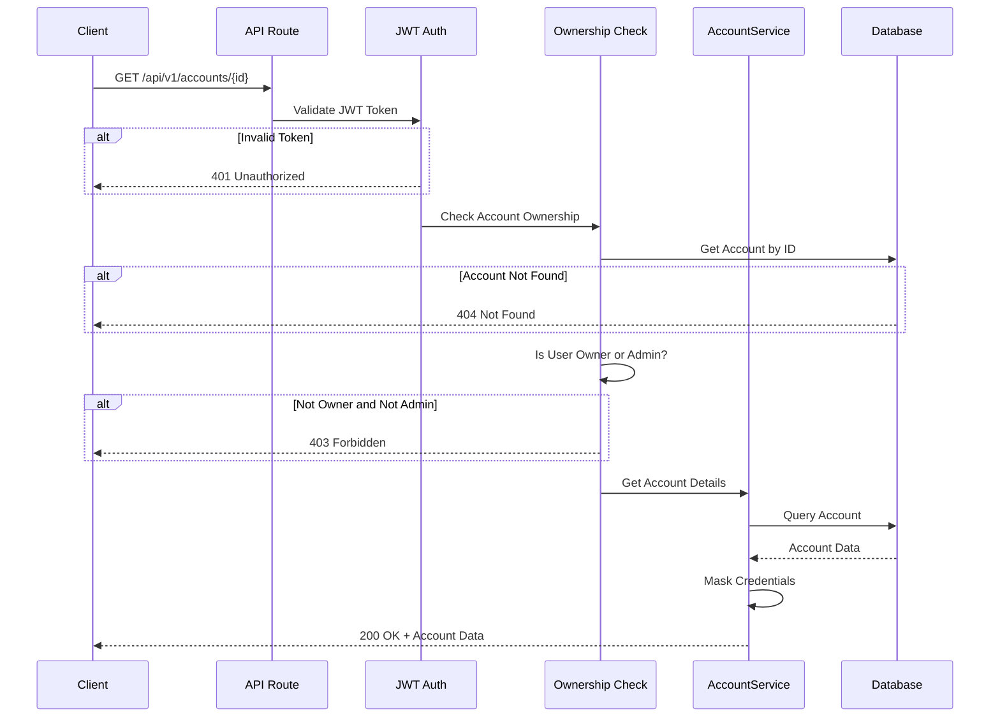
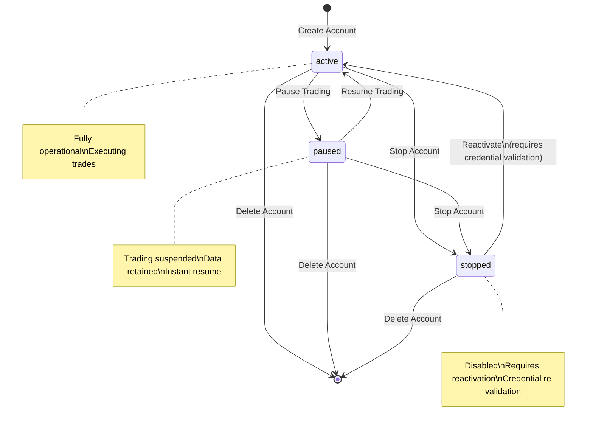
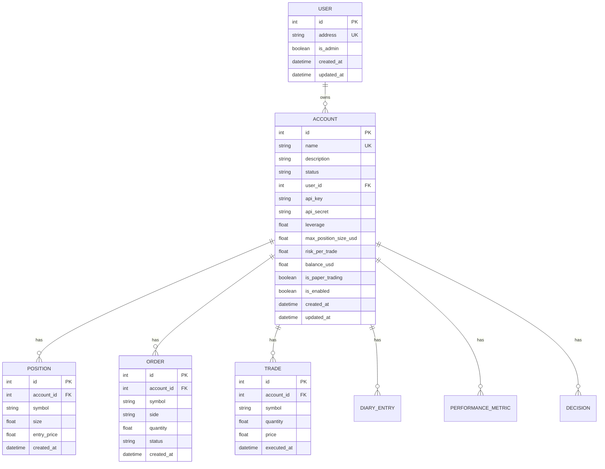
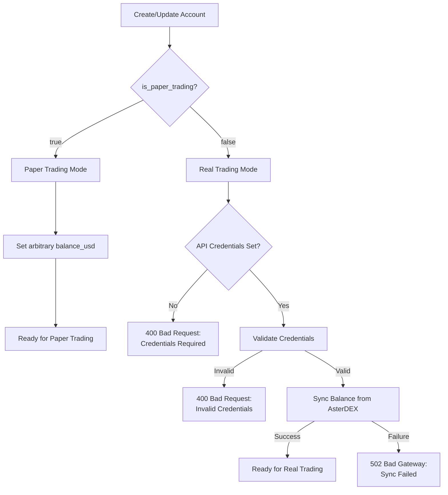

# Design Document

## Overview

This design document specifies the implementation of trading account management features for the AI Trading Agent API. The system extends the existing account model to provide comprehensive account ownership, access control, trading mode management (paper vs real), and balance synchronization with AsterDEX. The design follows RESTful API principles and integrates with the existing FastAPI application structure.

## Architecture

### High-Level Architecture



### Request Flow - Account Access Control



### Account Status State Machine



### Entity Relationship Diagram



### Paper Trading vs Real Trading Flow



## Components and Interfaces

### 1. Account Service (`backend/src/app/services/account_service.py`)

New service module for account management business logic:

```python
class AccountService:
    """Service for managing trading accounts with ownership control."""

    async def create_account(
        self,
        db: AsyncSession,
        user_id: int,
        data: AccountCreate,
    ) -> Account:
        """Create a new account for the user."""

    async def list_user_accounts(
        self,
        db: AsyncSession,
        user_id: int,
        skip: int = 0,
        limit: int = 100,
    ) -> List[Account]:
        """List all accounts owned by the user."""

    async def get_account(
        self,
        db: AsyncSession,
        account_id: int,
        user: User,
    ) -> Account:
        """Get account by ID with ownership check."""

    async def update_account(
        self,
        db: AsyncSession,
        account_id: int,
        user: User,
        data: AccountUpdate,
    ) -> Account:
        """Update account with ownership check."""

    async def delete_account(
        self,
        db: AsyncSession,
        account_id: int,
        user: User,
        force: bool = False,
    ) -> None:
        """Delete account with ownership check and cascade."""

    async def sync_balance(
        self,
        db: AsyncSession,
        account_id: int,
        user: User,
    ) -> Account:
        """Sync account balance from AsterDEX API."""

    def validate_trading_mode(
        self,
        account: Account,
        is_paper_trading: bool,
    ) -> None:
        """Validate trading mode requirements."""
```

### 2. Enhanced API Routes (`backend/src/app/api/routes/accounts.py`)

Updated router with ownership control:

```python
@router.post("", response_model=AccountRead, status_code=status.HTTP_201_CREATED)
async def create_account(
    account_data: AccountCreate,
    current_user: User = Depends(get_current_user),
    db: AsyncSession = Depends(get_db),
) -> AccountRead:
    """Create a new trading account for the authenticated user."""

@router.get("", response_model=AccountListResponse)
async def list_accounts(
    skip: int = Query(0, ge=0),
    limit: int = Query(100, gt=0, le=1000),
    current_user: User = Depends(get_current_user),
    db: AsyncSession = Depends(get_db),
) -> AccountListResponse:
    """List accounts owned by the authenticated user."""

@router.get("/{account_id}", response_model=AccountRead)
async def get_account(
    account_id: int,
    current_user: User = Depends(get_current_user),
    db: AsyncSession = Depends(get_db),
) -> AccountRead:
    """Get account by ID (owner or admin only)."""

@router.put("/{account_id}", response_model=AccountRead)
async def update_account(
    account_id: int,
    account_data: AccountUpdate,
    current_user: User = Depends(get_current_user),
    db: AsyncSession = Depends(get_db),
) -> AccountRead:
    """Update account (owner or admin only)."""

@router.delete("/{account_id}", status_code=status.HTTP_204_NO_CONTENT)
async def delete_account(
    account_id: int,
    force: bool = Query(False, description="Force delete even with active positions"),
    current_user: User = Depends(get_current_user),
    db: AsyncSession = Depends(get_db),
) -> None:
    """Delete account (owner or admin only)."""

@router.post("/{account_id}/sync-balance", response_model=AccountRead)
async def sync_balance(
    account_id: int,
    current_user: User = Depends(get_current_user),
    db: AsyncSession = Depends(get_db),
) -> AccountRead:
    """Sync account balance from AsterDEX API (real trading only)."""
```

### 3. Security Middleware (`backend/src/app/core/security.py`)

Enhanced security utilities for ownership control:

```python
async def require_account_owner(
    account_id: int,
    current_user: User = Depends(get_current_user),
    db: AsyncSession = Depends(get_db),
) -> Account:
    """
    Dependency that requires the current user to own the account.
    Raises HTTPException(403) if user doesn't own the account.
    """

async def require_admin_or_owner(
    account_id: int,
    current_user: User = Depends(get_current_user),
    db: AsyncSession = Depends(get_db),
) -> Account:
    """
    Dependency that requires the current user to be admin or own the account.
    Raises HTTPException(403) if neither condition is met.
    """
```

### 4. Enhanced Schemas (`backend/src/app/schemas/account.py`)

Updated Pydantic models:

```python
class AccountCreate(BaseCreateSchema):
    """Schema for creating an account."""
    name: str = Field(..., min_length=1, max_length=255)
    description: Optional[str] = Field(None, max_length=1000)
    api_key: Optional[str] = Field(None, description="AsterDEX API key")
    api_secret: Optional[str] = Field(None, description="AsterDEX API secret")
    leverage: float = Field(default=2.0, ge=1.0, le=5.0)
    max_position_size_usd: float = Field(default=10000.0, gt=0)
    risk_per_trade: float = Field(default=0.02, ge=0.01, le=0.1)
    is_paper_trading: bool = Field(default=True)
    balance_usd: Optional[float] = Field(None, ge=0, description="Initial balance for paper trading")

class AccountUpdate(BaseUpdateSchema):
    """Schema for updating an account."""
    name: Optional[str] = Field(None, min_length=1, max_length=255)
    description: Optional[str] = Field(None, max_length=1000)
    status: Optional[str] = Field(None, pattern="^(active|paused|stopped)$")
    api_key: Optional[str] = None
    api_secret: Optional[str] = None
    leverage: Optional[float] = Field(None, ge=1.0, le=5.0)
    max_position_size_usd: Optional[float] = Field(None, gt=0)
    risk_per_trade: Optional[float] = Field(None, ge=0.01, le=0.1)
    is_paper_trading: Optional[bool] = None
    is_enabled: Optional[bool] = None
    balance_usd: Optional[float] = Field(None, ge=0)

class AccountRead(BaseSchema):
    """Schema for reading an account with masked credentials."""
    id: int
    name: str
    description: Optional[str] = None
    status: str
    user_id: int
    has_api_credentials: bool  # True if api_key is set, credentials masked
    leverage: float
    max_position_size_usd: float
    risk_per_trade: float
    maker_fee_bps: float
    taker_fee_bps: float
    balance_usd: float
    is_paper_trading: bool
    is_enabled: bool
    created_at: datetime
    updated_at: datetime
```

## Data Models

The existing Account model in `backend/src/app/models/account.py` contains all necessary fields. No schema changes required.

Key relationships:
- Account belongs to User (via user_id foreign key)
- Account has many Positions, Orders, Trades (cascade delete)
- Account has many DiaryEntries, PerformanceMetrics, Decisions

## Correctness Properties

*A property is a characteristic or behavior that should hold true across all valid executions of a system-essentially, a formal statement about what the system should do. Properties serve as the bridge between human-readable specifications and machine-verifiable correctness guarantees.*

### Property Reflection

After analyzing the acceptance criteria, I identified the following redundancies:
- Access control properties (2.3, 3.2, 4.2) can be combined into one comprehensive ownership property
- Admin override properties (2.4, 3.3, 4.3) can be combined into one admin access property
- Response structure properties (2.5, 5.2) are about data masking and can be combined

### Correctness Properties

Property 1: Account creation persists all settings
*For any* valid account configuration provided by an authenticated user, creating an account should persist all settings and associate the account with that user.
**Validates: Requirements 1.1, 1.4**

Property 2: Account ownership filtering
*For any* user with N accounts, listing accounts should return exactly N accounts, all owned by that user.
**Validates: Requirements 2.1**

Property 3: Non-owner access denied
*For any* account not owned by a user (and user is not admin), attempting to read, update, or delete that account should return a 403 Forbidden error.
**Validates: Requirements 2.3, 3.2, 4.2**

Property 4: Admin access granted
*For any* admin user and any account, the admin should be able to read, update, or delete the account regardless of ownership.
**Validates: Requirements 2.4, 3.3, 4.3**

Property 5: Update persistence
*For any* valid update to an owned account, the changes should be persisted and the updated_at timestamp should change.
**Validates: Requirements 3.1, 3.4**

Property 6: Cascade deletion
*For any* deleted account, all related positions, orders, and trades should also be deleted.
**Validates: Requirements 4.1, 4.4**

Property 7: Credential masking
*For any* account with API credentials, the API response should mask sensitive values (api_key, api_secret).
**Validates: Requirements 5.2**

Property 8: Paper trading mode allows arbitrary balance
*For any* account with is_paper_trading=true, the balance_usd can be set to any non-negative value.
**Validates: Requirements 6.1, 6.4**

Property 9: Real trading requires credentials
*For any* account with is_paper_trading=false, valid API credentials must be configured.
**Validates: Requirements 5.5, 6.2**

Property 10: Balance sync updates balance
*For any* successful balance sync on a real trading account, the balance_usd field should be updated with the fetched value.
**Validates: Requirements 7.2**

Property 11: Status change logging
*For any* account status change, an audit log entry should exist with the old status, new status, and timestamp.
**Validates: Requirements 8.5**

Property 12: Account isolation - positions
*For any* two accounts, positions created for one account should not appear when querying positions for the other account.
**Validates: Requirements 9.2, 9.5**

Property 13: Account isolation - metrics
*For any* two accounts, performance metrics calculated for one account should be independent of the other account's data.
**Validates: Requirements 9.3**

## Error Handling

### HTTP Status Codes

- **200 OK**: Successful GET/PUT requests
- **201 Created**: Successful POST (create) requests
- **204 No Content**: Successful DELETE requests
- **400 Bad Request**: Invalid input (duplicate name, invalid credentials, paper trading sync)
- **401 Unauthorized**: Missing or invalid JWT token, invalid API credentials during sync
- **403 Forbidden**: Valid token but insufficient privileges (not owner or admin)
- **404 Not Found**: Requested account does not exist
- **422 Unprocessable Entity**: Validation errors (missing required fields, invalid values)
- **502 Bad Gateway**: External API errors (AsterDEX API failures)
- **500 Internal Server Error**: Unexpected server errors

### Error Response Format

```json
{
  "detail": "Error message describing what went wrong"
}
```

### Custom Exceptions

```python
class AccountNotFoundError(Exception):
    """Raised when an account is not found."""

class AccountAccessDeniedError(Exception):
    """Raised when user doesn't have access to an account."""

class AccountValidationError(Exception):
    """Raised when account validation fails."""

class BalanceSyncError(Exception):
    """Raised when balance sync fails."""

class ActivePositionsError(Exception):
    """Raised when trying to delete account with active positions."""

class StatusTransitionError(Exception):
    """Raised when an invalid status transition is attempted."""
```

## Testing Strategy

### Unit Testing

Unit tests will verify individual service functions with mocked database sessions:

- `test_create_account_success`: Verify account creation with valid data
- `test_create_account_duplicate_name`: Verify error for duplicate names
- `test_list_user_accounts`: Verify ownership filtering
- `test_get_account_owner`: Verify owner can access account
- `test_get_account_non_owner`: Verify non-owner gets 403
- `test_get_account_admin`: Verify admin can access any account
- `test_update_account_owner`: Verify owner can update
- `test_update_account_non_owner`: Verify non-owner gets 403
- `test_delete_account_cascade`: Verify cascade deletion
- `test_validate_trading_mode`: Verify paper/real trading validation

### Integration Testing

Integration tests will verify relationships with other modules using mocked database:

- `test_account_position_relationship`: Verify account-position cascade
- `test_account_order_relationship`: Verify account-order cascade
- `test_account_trade_relationship`: Verify account-trade cascade
- `test_account_user_relationship`: Verify account-user association

### E2E Testing

E2E tests will verify HTTP API with real database:

- `test_create_account_api`: Test POST /api/v1/accounts
- `test_list_accounts_api`: Test GET /api/v1/accounts with ownership
- `test_get_account_api_owner`: Test GET /api/v1/accounts/{id} as owner
- `test_get_account_api_non_owner`: Test GET /api/v1/accounts/{id} as non-owner
- `test_get_account_api_admin`: Test GET /api/v1/accounts/{id} as admin
- `test_update_account_api`: Test PUT /api/v1/accounts/{id}
- `test_delete_account_api`: Test DELETE /api/v1/accounts/{id}
- `test_sync_balance_api`: Test POST /api/v1/accounts/{id}/sync-balance

### Property-Based Testing

We will use `pytest` with `hypothesis` for property-based testing:

- **Framework**: pytest with hypothesis
- **Minimum iterations**: 100 per property test
- **Test annotation format**: `**Feature: account-management, Property {number}: {property_text}**`

Property tests:
- Generate random account configurations and verify persistence
- Generate random user/account combinations and verify ownership filtering
- Generate random updates and verify persistence
- Verify cascade deletion with random related entities
- Verify credential masking across random accounts

## Security Considerations

### Authentication

- All account endpoints require valid JWT token
- Token must contain valid user address
- Token expiration enforced

### Authorization

- Account operations protected by ownership check
- Admin users can override ownership restrictions
- Users cannot access other users' accounts

### Credential Security

- API credentials encrypted at rest
- Credentials masked in API responses
- Credentials never logged

### Audit Logging

- All account operations logged with:
  - Timestamp
  - User address
  - Account ID
  - Action performed
  - Result (success/failure)
- Status changes logged with old/new values

## Deployment Considerations

### Database Migrations

No database migrations required - Account model already exists with all necessary fields.

### Backward Compatibility

- Existing account endpoints enhanced with ownership control
- Existing accounts will need user_id populated (migration script if needed)
- New endpoints (sync-balance) added without breaking existing functionality

### Performance

- Account queries filtered by user_id use index
- Cascade deletion handled by database
- Balance sync is async to avoid blocking

---

**Document Version**: 1.0
**Last Updated**: November 26, 2025
**Status**: Ready for Implementation
